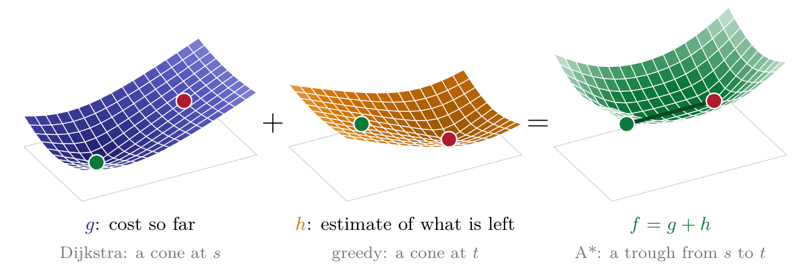
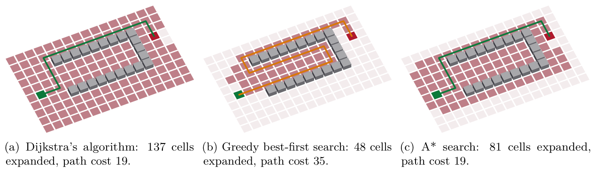
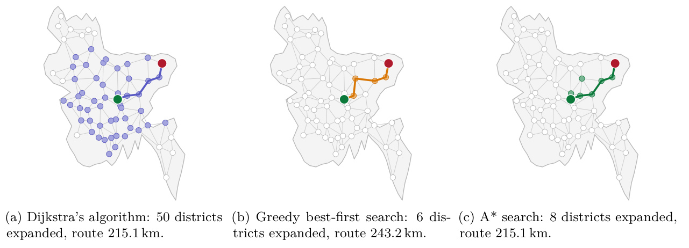

# A* pathfinding

Code for the report *The A\* Search Algorithm* (CSE200, BUET). It runs
Dijkstra's algorithm, greedy best-first search and A\* on three graphs and
produces every trace, table and result in the report.



## Run

```
python3 make_figures.py
```

Only Python 3 is needed. The summary is written to `output/results.txt`, and
the LaTeX sources of the report's figures and tables to `output/tex/`.

## Files

| File | Contents |
|---|---|
| `searches.py` | Dijkstra, greedy best-first search, A\* and A\* with reopening |
| `make_figures.py` | runs every search and writes the outputs |
| `data/bangladesh.json` | the 64 districts of Bangladesh and the 133 edges between neighbors |

## Results

| Instance | Dijkstra | Greedy best-first | A\* |
|---|---|---|---|
| Eight-city example (expanded / cost) | 8 / 8 | 4 / 10 | 5 / 8 |
| Grid with a U-shaped wall | 137 / 19 | 48 / 35 | 81 / 19 |
| Dhaka to Sylhet, 64 districts | 50 / 215.1 km | 6 / 243.2 km | 8 / 215.1 km |




